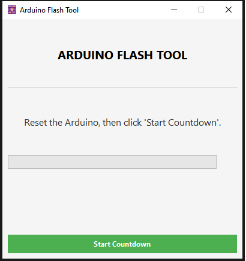
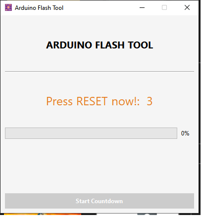
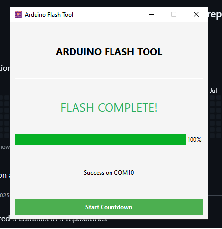

# Arduino Leonardo R3 Flashing Tool with Mouse Driver

A professional flashing tool for Arduino Leonardo R3 boards with custom HID mouse driver capabilities.

## Features
- Easy firmware flashing for Arduino Leonardo R3
- Custom HID mouse driver implementation
- User-friendly graphical interface
- Real-time progress tracking

## Screenshots

### Flash Tool Interface

### Starting Flash Process

### Countdown Timer

### Flash Complete

## Installation
1. Download this repository
2. Run `flash_tool.exe`
3. Connect your Arduino Leonardo R3
4. Follow the on-screen instructions

## Usage
1. Launch the application
2. Select your COM port
3. Click "Start Flash" to begin the process
4. Wait for the countdown to complete
5. Your device will be ready to use!

## Requirements
- Windows OS
- Arduino Leonardo R3 board
- USB cable
